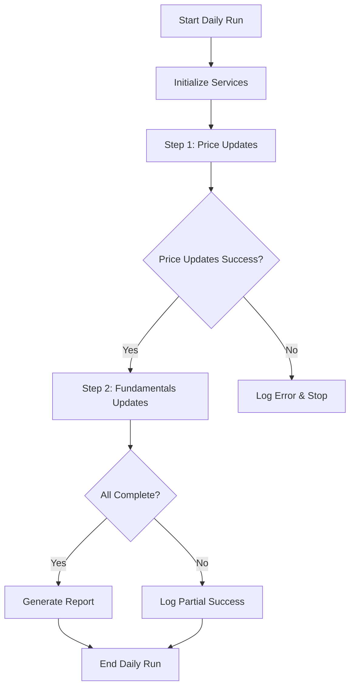

# Financial Data Pipeline System Documentation

## Table of Contents
1. [System Architecture](#system-architecture)
2. [Daily Run Flow](#daily-run-flow)
3. [Cron Setup](#cron-setup)
4. [Core Functions](#core-functions)
5. [Utility Functions](#utility-functions)
6. [Configuration](#configuration)
7. [Troubleshooting](#troubleshooting)

---

## System Architecture

### Overview
The Financial Data Pipeline System is a modular, production-ready system designed to collect, process, and store financial data for stock market analysis. The system follows a microservices architecture pattern with clear separation of concerns.

### Architecture Components

```
┌─────────────────────────────────────────────────────────────┐
│                    INTEGRATED DAILY RUNNER                  │
│                     (Main Orchestrator)                     │
└─────────────────────┬───────────────────────────────────────┘
                      │
        ┌─────────────┴─────────────┐
        │                           │
┌───────▼────────┐        ┌────────▼────────┐
│  PRICE UPDATES │        │ FUNDAMENTALS    │
│   (Priority)   │        │   UPDATES       │
└───────┬────────┘        └────────┬────────┘
        │                          │
┌───────▼────────┐        ┌────────▼────────┐
│  Price Service │        │ FMP Service     │
│  (Multi-API)   │        │ (Financial)     │
└───────┬────────┘        └────────┬────────┘
        │                          │
┌───────▼────────┐        ┌────────▼────────┐
│  Database      │        │  Database       │
│  (Prices)      │        │  (Fundamentals) │
└────────────────┘        └─────────────────┘
```

### Core Modules

#### 1. **Integrated Daily Runner** (`integrated_daily_runner.py`)
- **Purpose**: Main orchestrator for the entire daily pipeline
- **Responsibilities**: 
  - Coordinate price and fundamental updates
  - Manage execution order and dependencies
  - Handle error recovery and logging
  - Provide comprehensive reporting

#### 2. **Price Service** (`price_service.py`)
- **Purpose**: Collect current market prices from multiple providers
- **Providers**: Yahoo Finance, Alpha Vantage, Finnhub, FMP
- **Features**: Fallback logic, rate limiting, error handling

#### 3. **FMP Service** (`fmp_service.py`)
- **Purpose**: Collect fundamental financial data
- **Data Types**: Financial statements, key metrics, company profiles
- **Features**: TTM calculations, data standardization, storage

#### 4. **Database Manager** (`database.py`)
- **Purpose**: Centralized database operations
- **Features**: Connection pooling, transaction management, error handling

#### 5. **Service Factory** (`service_factory.py`)
- **Purpose**: Factory pattern for creating service instances
- **Features**: Provider selection, configuration management

### Data Flow

1. **Price Collection Flow**:
   ```
   Ticker List → Price Service → Multiple APIs → Database (stocks table)
   ```

2. **Fundamental Collection Flow**:
   ```
   Ticker List → FMP Service → Financial APIs → Database (stocks table)
   ```

3. **Ratio Calculation Flow**:
   ```
   Price Data + Fundamental Data → Ratio Calculator → Database (financial_ratios table)
   ```

---

## Daily Run Flow

### Execution Sequence



### Detailed Flow

#### Phase 1: Price Updates (Priority)
1. **Initialize**: Load configuration, connect to database
2. **Get Tickers**: Retrieve list of all tickers from database
3. **Price Collection**: 
   - Try Yahoo Finance first
   - Fallback to Alpha Vantage
   - Fallback to Finnhub
   - Fallback to FMP
4. **Rate Limiting**: Respect API limits between requests
5. **Database Update**: Store current prices in `stocks` table
6. **Logging**: Record success/failure for each ticker

#### Phase 2: Fundamentals Updates (Conditional)
1. **Identify Needs**: Find tickers missing fundamental data or after earnings
2. **Prioritize**: Sort by urgency (missing data > after earnings)
3. **Update Fundamentals**:
   - Fetch financial statements from FMP
   - Fetch key metrics from FMP
   - Calculate TTM values
   - Store in database
4. **Rate Limiting**: Respect FMP API limits
5. **Logging**: Record update status

#### Phase 3: Ratio Calculations
1. **Identify Candidates**: Find tickers with both price and fundamental data
2. **Calculate Ratios**: P/E, P/B, P/S, Debt/Equity, etc.
3. **Store Results**: Update `financial_ratios` table
4. **Validation**: Ensure calculated ratios are reasonable

### Error Handling Strategy

- **Graceful Degradation**: If one provider fails, try others
- **Partial Success**: Continue processing even if some tickers fail
- **Detailed Logging**: Record all errors for debugging
- **Rate Limit Respect**: Automatically pause when limits are hit
- **Transaction Safety**: Database operations are atomic

---

## Cron Setup

### Production Cron Configuration

#### 1. **Daily Market Open Run** (9:30 AM EST)
```bash
# Add to crontab: crontab -e
30 9 * * 1-5 cd /path/to/ourstox6/daily_run && /usr/bin/python3 integrated_daily_runner.py >> logs/cron_daily.log 2>&1
```

#### 2. **Market Close Run** (4:00 PM EST)
```bash
# Add to crontab: crontab -e
0 16 * * 1-5 cd /path/to/ourstox6/daily_run && /usr/bin/python3 integrated_daily_runner.py >> logs/cron_close.log 2>&1
```

#### 3. **Weekend Maintenance Run** (Saturday 6:00 AM)
```bash
# Add to crontab: crontab -e
0 6 * * 6 cd /path/to/ourstox6/daily_run && /usr/bin/python3 integrated_daily_runner.py --max-price-tickers 200 --max-fundamental-tickers 100 >> logs/cron_weekend.log 2>&1
```

### Environment Setup

#### 1. **Create Environment File**
```bash
# Create .env file in daily_run directory
cat > .env << EOF
DB_HOST=your_database_host
DB_PORT=5432
DB_NAME=your_database_name
DB_USER=your_database_user
DB_PASSWORD=your_database_password

# API Keys
ALPHA_VANTAGE_API_KEY=your_alpha_vantage_key
FMP_API_KEY=your_fmp_key
FINNHUB_API_KEY=your_finnhub_key

# Rate Limiting
YAHOO_RATE_LIMIT=100
ALPHA_VANTAGE_RATE_LIMIT=25
FINNHUB_RATE_LIMIT=60
FMP_RATE_LIMIT=250
EOF
```

#### 2. **Create Log Directory**
```bash
mkdir -p logs
chmod 755 logs
```

#### 3. **Test Cron Setup**
```bash
# Test the command manually first
cd /path/to/ourstox6/daily_run
python3 integrated_daily_runner.py --test

# Check if cron can find the script
which python3
which integrated_daily_runner.py
```

### Monitoring Cron Jobs

#### 1. **Check Cron Status**
```bash
# View cron logs
tail -f logs/cron_daily.log
tail -f logs/cron_close.log

# Check cron job status
crontab -l

# Check system cron logs
sudo tail -f /var/log/cron
```

#### 2. **Health Check Script**
```bash
# Create health check script
cat > check_system_health.sh << 'EOF'
#!/bin/bash
LOG_FILE="logs/system_health.log"
echo "$(date): Checking system health..." >> $LOG_FILE

# Check if database is accessible
python3 -c "from database import DatabaseManager; db = DatabaseManager(); db.connect(); print('DB OK')" >> $LOG_FILE 2>&1

# Check if recent data exists
python3 -c "from database import DatabaseManager; db = DatabaseManager(); db.connect(); result = db.execute_query('SELECT COUNT(*) FROM stocks WHERE updated_at >= NOW() - INTERVAL \"1 day\"'); print(f'Recent updates: {result[0][0]}')" >> $LOG_FILE 2>&1

echo "$(date): Health check complete" >> $LOG_FILE
EOF

chmod +x check_system_health.sh
```

---

## Core Functions

### Integrated Daily Runner

#### `IntegratedDailyRunner.run_complete_daily_pipeline()`
- **Purpose**: Main entry point for daily pipeline execution
- **Parameters**:
  - `test_mode`: Boolean, run with limited tickers
  - `max_price_tickers`: Integer, limit price updates
  - `max_fundamental_tickers`: Integer, limit fundamental updates
- **Returns**: Dictionary with execution results
- **Error Handling**: Comprehensive error catching and logging

#### `IntegratedDailyRunner.__init__()`
- **Purpose**: Initialize runner with all required services
- **Dependencies**: Config, DatabaseManager, ServiceFactory
- **Setup**: Logging, statistics tracking

### Daily Fundamentals Updater

#### `DailyFundamentalsUpdater.get_tickers_needing_updates()`
- **Purpose**: Identify tickers requiring fundamental updates
- **Criteria**:
  - Missing shares_outstanding
  - Missing earnings_date
  - Missing financial data (>5 fields)
  - After earnings date
- **Returns**: List of ticker dictionaries with reasons

#### `DailyFundamentalsUpdater.update_ticker_fundamentals()`
- **Purpose**: Update fundamentals for single ticker
- **Process**:
  1. Fetch financial statements
  2. Fetch key statistics
  3. Store in database
- **Error Handling**: Individual ticker failure doesn't stop pipeline

#### `DailyFundamentalsUpdater.run_daily_update()`
- **Purpose**: Orchestrate fundamental updates for multiple tickers
- **Features**: Rate limiting, progress tracking, result aggregation

### FMP Service

#### `FMPService.fetch_financial_statements()`
- **Purpose**: Retrieve income statement, balance sheet, cash flow
- **Data Processing**: Calculate TTM values from quarterly data
- **Rate Limiting**: Built-in API limit management

#### `FMPService.fetch_key_statistics()`
- **Purpose**: Get company profile and key metrics
- **Data Types**: Market cap, shares outstanding, enterprise value
- **Standardization**: Normalize data formats

#### `FMPService.store_fundamental_data()`
- **Purpose**: Store processed fundamental data in database
- **Features**: Transaction safety, data validation, logging

### Price Service

#### `PriceCollector.run()`
- **Purpose**: Collect current prices for all tickers
- **Fallback Logic**: Try multiple providers in sequence
- **Rate Limiting**: Respect each provider's limits
- **Returns**: Summary of successful/failed updates

#### `PriceCollector.update_prices()`
- **Purpose**: Update prices for specific ticker list
- **Error Handling**: Individual failures don't stop batch
- **Logging**: Detailed success/failure tracking

### Database Manager

#### `DatabaseManager.connect()`
- **Purpose**: Establish database connection
- **Features**: Connection pooling, error handling
- **Configuration**: Environment-based settings

#### `DatabaseManager.execute_query()`
- **Purpose**: Execute SELECT queries
- **Features**: Parameterized queries, error handling
- **Returns**: Query results as list of tuples

#### `DatabaseManager.execute_update()`
- **Purpose**: Execute INSERT/UPDATE/DELETE queries
- **Features**: Transaction safety, parameterized queries
- **Returns**: Number of affected rows

---

## Utility Functions

### Development and Testing Utilities

#### `test_fundamentals_updater.py`
- **Purpose**: Test fundamental updater functionality
- **Usage**: Development testing only
- **Features**: 
  - Test ticker identification
  - Test individual updates
  - Verify database state

#### `test_integration.py`
- **Purpose**: Test complete system integration
- **Usage**: Development testing only
- **Features**:
  - Test all components together
  - Verify data flow
  - Check error handling

#### `debug_shares_outstanding.py`
- **Purpose**: Debug shares outstanding calculation issues
- **Usage**: Troubleshooting only
- **Features**:
  - Detailed FMP API response analysis
  - Data validation checks
  - Error diagnosis

### Data Analysis Utilities

#### `check_missing_data.py`
- **Purpose**: Analyze missing data patterns
- **Usage**: Data quality analysis
- **Features**:
  - Identify data gaps
  - Generate missing data reports
  - Prioritize update needs

#### `check_database_updates.py`
- **Purpose**: Monitor recent database changes
- **Usage**: System monitoring
- **Features**:
  - Track recent updates
  - Monitor data freshness
  - Identify update patterns

#### `system_status_summary_fixed.py`
- **Purpose**: Generate system health report
- **Usage**: Monitoring and maintenance
- **Features**:
  - Current system state
  - Data completeness metrics
  - Health indicators

### Data Fixing Utilities

#### `fix_with_calculations_fixed.py`
- **Purpose**: Fix missing shares outstanding using calculations
- **Usage**: One-time data fixes
- **Features**:
  - Calculate shares from market cap/price
  - Add placeholder earnings dates
  - Bulk data updates

#### `fix_missing_data_simple.py`
- **Purpose**: Simple data repair utilities
- **Usage**: Emergency data fixes
- **Features**:
  - Basic data validation
  - Simple corrections
  - Error reporting

### Configuration and Setup Utilities

#### `check_price_columns.py`
- **Purpose**: Analyze database schema
- **Usage**: Database maintenance
- **Features**:
  - Column analysis
  - Schema validation
  - Data type checking

#### `check_stocks_schema.py`
- **Purpose**: Verify database structure
- **Usage**: Setup and maintenance
- **Features**:
  - Schema validation
  - Column verification
  - Constraint checking

### Production Utilities (Keep)

#### `final_summary.py`
- **Purpose**: Generate comprehensive system summary
- **Usage**: Production monitoring
- **Features**:
  - System health overview
  - Data completeness report
  - Performance metrics

#### `production_daily_runner.py`
- **Purpose**: Production-ready daily runner
- **Usage**: Production deployment
- **Features**:
  - Full pipeline execution
  - Comprehensive logging
  - Error recovery

### Archive Utilities (Remove for Production)

#### Files in `archive_20250622_215640/`
- **Purpose**: Legacy code from previous implementation
- **Status**: Deprecated, safe to remove
- **Contains**: Old implementations, duplicate code

#### `new_daily_pipeline.py`
- **Purpose**: Previous pipeline implementation
- **Status**: Replaced by integrated_daily_runner.py
- **Action**: Safe to remove

#### `fundamental_service.py`
- **Purpose**: Previous fundamental service
- **Status**: Replaced by FMP service
- **Action**: Safe to remove

---

## Configuration

### Environment Variables

```bash
# Database Configuration
DB_HOST=localhost
DB_PORT=5432
DB_NAME=financial_data
DB_USER=your_user
DB_PASSWORD=your_password

# API Keys
ALPHA_VANTAGE_API_KEY=your_key
FMP_API_KEY=your_key
FINNHUB_API_KEY=your_key

# Rate Limiting
YAHOO_RATE_LIMIT=100
ALPHA_VANTAGE_RATE_LIMIT=25
FINNHUB_RATE_LIMIT=60
FMP_RATE_LIMIT=250

# Logging
LOG_LEVEL=INFO
LOG_FILE=logs/daily_pipeline.log
```

### Configuration File (`config.py`)

```python
class Config:
    # Database settings
    DB_HOST = os.getenv('DB_HOST', 'localhost')
    DB_PORT = int(os.getenv('DB_PORT', 5432))
    DB_NAME = os.getenv('DB_NAME', 'financial_data')
    DB_USER = os.getenv('DB_USER', 'postgres')
    DB_PASSWORD = os.getenv('DB_PASSWORD', '')
    
    # API Keys
    ALPHA_VANTAGE_API_KEY = os.getenv('ALPHA_VANTAGE_API_KEY')
    FMP_API_KEY = os.getenv('FMP_API_KEY')
    FINNHUB_API_KEY = os.getenv('FINNHUB_API_KEY')
    
    # Rate Limiting
    YAHOO_RATE_LIMIT = int(os.getenv('YAHOO_RATE_LIMIT', 100))
    ALPHA_VANTAGE_RATE_LIMIT = int(os.getenv('ALPHA_VANTAGE_RATE_LIMIT', 25))
    FINNHUB_RATE_LIMIT = int(os.getenv('FINNHUB_RATE_LIMIT', 60))
    FMP_RATE_LIMIT = int(os.getenv('FMP_RATE_LIMIT', 250))
```

---

## Troubleshooting

### Common Issues

#### 1. **Rate Limiting Errors**
```bash
# Symptoms: "Too Many Requests" errors
# Solution: Increase delays between requests
# Check: API key limits and usage
```

#### 2. **Database Connection Issues**
```bash
# Symptoms: Connection timeout errors
# Solution: Check database credentials and network
# Verify: .env file configuration
```

#### 3. **Missing Data**
```bash
# Symptoms: NULL values in expected fields
# Solution: Run data fixing utilities
# Check: API provider availability
```

#### 4. **Cron Job Not Running**
```bash
# Symptoms: No log files created
# Solution: Check cron service status
# Verify: File paths and permissions
```

### Debug Commands

```bash
# Test database connection
python3 -c "from database import DatabaseManager; db = DatabaseManager(); db.connect(); print('Connected')"

# Test API keys
python3 -c "from config import Config; c = Config(); print(f'FMP Key: {c.FMP_API_KEY[:10]}...')"

# Check recent updates
python3 system_status_summary_fixed.py

# Test individual components
python3 test_fundamentals_updater.py
```

### Log Analysis

```bash
# Monitor real-time logs
tail -f logs/daily_pipeline.log

# Search for errors
grep -i error logs/daily_pipeline.log

# Check recent activity
grep "$(date +%Y-%m-%d)" logs/daily_pipeline.log
```

---

## Production Deployment Checklist

### Pre-Deployment
- [ ] All API keys configured
- [ ] Database credentials verified
- [ ] Log directory created with proper permissions
- [ ] Test run completed successfully
- [ ] Cron jobs configured
- [ ] Monitoring scripts in place

### Post-Deployment
- [ ] First cron run completed
- [ ] Log files being generated
- [ ] Database updates occurring
- [ ] Error rates acceptable
- [ ] Performance metrics within expected ranges

### Maintenance
- [ ] Regular log rotation
- [ ] Database backup verification
- [ ] API key usage monitoring
- [ ] System health checks
- [ ] Performance optimization

---

*This documentation covers the complete Financial Data Pipeline System. For additional support, refer to the troubleshooting section or check the log files for specific error details.* 